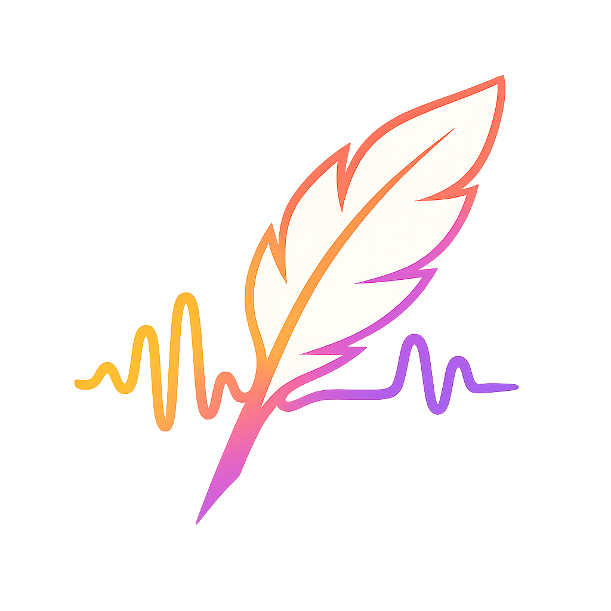

<div align="center">
  

  <h1>WhisperPaste</h1>

  <p>
    🎙️ → 🧠 → 📋  
    Dictate from your menu bar. Live preview while speaking, instant transcription, optional cleanup, and your final text lands in the clipboard — ready to paste.
  </p>

  <p>
    
    
    
  </p>
</div>

Features
- ⚡️ Live preview while speaking (Apple Speech).
- 🔊 Transcription via OpenAI Whisper or compatible “transcribe” models.
- ✨ Cleanup (optional): punctuation, grammar, paragraphs — with your own prompt.
- 🏎️ Transcription‑only mode with a dedicated “Transcription Prompt” for speed.
- 📋 Auto‑copy final text and keep a searchable history.
- 🧪 Benchmark window to compare model speeds.
- 🎛️ Model filtering (hide “preview” / two‑digit variants by default) with “Show all models”.
- 🖼️ Crisp, monochrome status icon and friendly UI.

Requirements
- macOS 12+
- Xcode (or CLT) with Swift 5.7+

Quick Start
- Dev (SwiftPM):
  - `chmod +x scripts/*.sh`
  - `./scripts/build_and_run.sh`
  - Click the tray icon to record; set your API key in Settings.
- Packaged app:
  - `./scripts/run_app.sh`
  - Launch `dist/WhisperPaste.app` (has proper icons and usage descriptions).

Settings (what to tweak)
- OpenAI API key (stored securely in Keychain).
- Transcription Model + Transcription Prompt (sent to the transcription endpoint).
- Enable cleanup (chat model) to show Cleanup Model + Cleanup Prompt; disable for transcription‑only.
- Show all models (applies to cleanup model list).
- Keep audio files (saves M4A under Application Support) and Hotkey.

Privacy & Storage
- Settings + history: `~/Library/Application Support/whisperpaste/`.
- Audio: compressed to low‑bitrate AAC (M4A) before upload to save bandwidth.
- API key: stored only in Keychain (never persisted to JSON).

Developer Scripts
- `scripts/test.sh` — run unit tests for the core library.
- `scripts/run.sh` — build + run via SwiftPM with a dev tray icon.
- `scripts/build_and_run.sh` — tests + run.
- `scripts/build.sh` — release build (SPM).
- `scripts/package_app.sh` — create `dist/WhisperPaste.app`.

Roadmap & Contributing
- Check `PLAN.md` for the roadmap and `AGENTS.md` for how we work (tests before commits, small focused changes, etc.).
- PRs welcome — especially around UI polish, model adapters, and test coverage.

License
MIT — see `LICENSE`.

## Requirements
- macOS 12+
- Xcode (or Command Line Tools) with Swift 5.7+

## Scripts
- `scripts/test.sh`: Runs unit tests for the core library.
- `scripts/build.sh`: Builds the app (SPM executable) in release mode.
- `scripts/run.sh`: Builds and runs the app.
- `scripts/build_and_run.sh`: Runs tests, then builds and runs.
- `scripts/package_app.sh`: Packages a proper macOS `.app` bundle with Info.plist (Mic + Speech usage descriptions). Launch it with `open dist/Whisper2.app`.

Usage:

```bash
# from repo root
chmod +x scripts/*.sh
./scripts/test.sh
./scripts/run.sh
# or
./scripts/build_and_run.sh
```

Notes:
- The current SPM executable starts an NSApplication and creates a menu bar item; left-click toggles a popover with a live-preview placeholder and right-click opens a menu (Settings, History, Quit).
- Live preview uses Apple Speech (SFSpeechRecognizer) with AVAudioEngine. For reliable permission prompts, prefer the packaged app (`package_app.sh`) so the system sees usage descriptions.
- OpenAI transcription + cleanup run after you stop recording. You must set your API key in Settings. Model dropdowns can be refreshed via the API.

See `PLAN.md` for the roadmap and `AGENTS.md` for contribution/commit guidelines.
